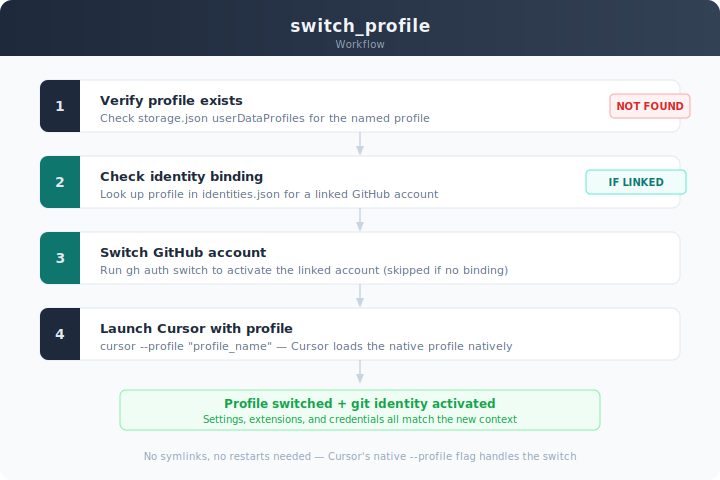
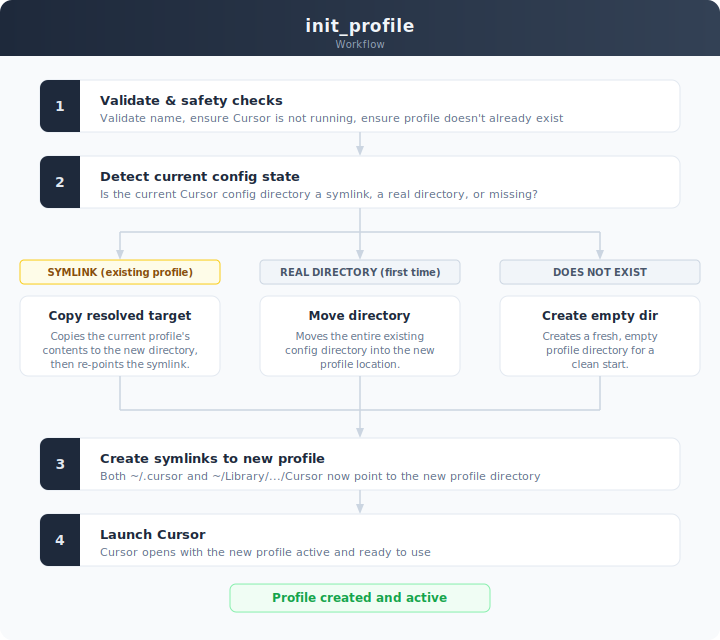
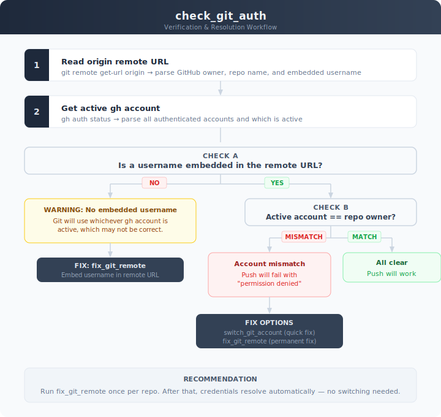

# MCP Cursor Profiles Server

An MCP (Model Context Protocol) server for managing multiple Cursor IDE profiles across different platforms.

## The Problem

Cursor stores all configuration — settings, extensions, keybindings, and MCP servers — in a single set of directories. If you juggle multiple projects, clients, or GitHub identities, there's no built-in way to isolate them. You end up manually swapping configs, fighting git credential conflicts, and hoping you don't push to the wrong repo with the wrong account.


## Features

- Switch between Cursor profiles seamlessly
- Create new profiles from current configuration
- Rename existing profiles
- List all available profiles with active profile indication
- Automatic MCP config propagation across profiles
- Git authentication management across multiple GitHub accounts
- Cross-platform support (macOS, Windows, Linux)
- Safety checks to prevent data corruption while Cursor is running

## Prerequisites

- Python 3.10 or higher
- [uv](https://github.com/astral-sh/uv) package manager
- Cursor IDE installed
- [gh](https://cli.github.com/) CLI (required for git auth tools)

## Installation & Configuration

Clone the repository and install as a tool:

```bash
git clone https://github.com/aigentic-net/mcp-cursor-profiles.git
cd mcp-cursor-profiles
uv tool install -e .
```

Then add to your MCP client configuration (Cursor, Claude Desktop, etc.):

```json
{
  "mcpServers": {
    "cursor-profiles": {
      "command": "cursor-profiles-mcp"
    }
  }
}
```

`uv tool install` places the `cursor-profiles-mcp` binary on your PATH (at `~/.local/bin/` by default). No `uvx` needed -- `uvx` resolves from PyPI and this package is not published there.

> **Note:** If `~/.local/bin` is not on your PATH, use the full path instead:
>
> ```json
> { "command": "/Users/you/.local/bin/cursor-profiles-mcp" }
> ```
>
> You can find the exact path with `uv tool dir --bin`.

> **Updating:** After pulling new changes, re-run `uv tool install -e .` to pick them up.

### Post-Install: Sync MCP Config

After setting up your MCP servers, run `sync_mcp_config` to copy your `mcp.json` to all profiles. This ensures every profile has access to the same MCP servers -- including `cursor-profiles-mcp` itself, so you can always switch back.

`switch_profile` also auto-injects `cursor-profiles-mcp` into any target profile that's missing it, as a safety net.

## Architecture


## Available Tools

### Profile Management

#### `show_profiles`

List all available Cursor profiles. The active profile is marked with an asterisk (`*`).

#### `switch_profile`

Switch to a specific profile and open Cursor. Automatically ensures the target profile has `cursor-profiles-mcp` configured before switching.



| Parameter      | Type   | Description                       |
| -------------- | ------ | --------------------------------- |
| `profile_name` | string | Name of the profile to switch to  |

#### `init_profile`

Create a new profile from your current Cursor configuration. Copies all settings, extensions, and MCP config.



| Parameter      | Type   | Description              |
| -------------- | ------ | ------------------------ |
| `profile_name` | string | Name for the new profile |

#### `rename_profile`

Rename an existing profile.

| Parameter  | Type   | Description          |
| ---------- | ------ | -------------------- |
| `old_name` | string | Current profile name |
| `new_name` | string | New profile name     |

#### `open_cursor`

Open the Cursor application with the current profile.

#### `sync_mcp_config`

Copy the current profile's `mcp.json` to all other profiles. Run this after adding or changing MCP servers to keep all profiles in sync.

### Git Authentication

These tools manage GitHub authentication across multiple accounts via the `gh` CLI.



#### `list_git_accounts`

List all GitHub accounts authenticated via the `gh` CLI. Shows which account is currently active.

#### `check_git_auth`

Check whether the active `gh` account matches a repository's GitHub remote owner. Reports mismatches and suggests fixes.

| Parameter   | Type   | Description                              |
| ----------- | ------ | ---------------------------------------- |
| `repo_path` | string | Absolute path to the git repository      |

#### `fix_git_remote`

Embed the GitHub username in a repo's `origin` URL so the `gh` credential helper automatically resolves the correct account -- no manual `gh auth switch` needed.

| Parameter   | Type   | Description                                           |
| ----------- | ------ | ----------------------------------------------------- |
| `repo_path` | string | Absolute path to the git repository                   |
| `username`  | string | GitHub username to embed (defaults to the repo owner) |

#### `switch_git_account`

Switch the active GitHub account in the `gh` CLI.

| Parameter | Type   | Description                     |
| --------- | ------ | ------------------------------- |
| `account` | string | GitHub username to switch to    |

## Platform Support

| Platform  | Cursor Config Path                     |
| --------- | -------------------------------------- |
| macOS     | `~/Library/Application Support/Cursor` |
| Windows   | `%APPDATA%/Cursor`                     |
| Linux     | `~/.config/Cursor`                     |

## How It Works

1. Creates symlinks from the main Cursor directories to profile-specific directories
2. Maintains two sets of profiles (Application Support and dotfile versions)
3. Ensures Cursor is closed before profile operations to prevent data corruption
4. Automatically detects the correct paths for your operating system
5. Propagates MCP config across profiles so you never lose access to your tools

### Why MCP Config Propagation Matters

Cursor stores its MCP server configuration in `~/.cursor/mcp.json`. Since `~/.cursor` is a symlink that gets swapped on profile switch, switching to a profile without `mcp.json` would lose **all** MCP servers -- including `cursor-profiles-mcp` itself. This would strand you in a profile with no way to switch back.

To prevent this:
- `switch_profile` auto-injects `cursor-profiles-mcp` into any target profile missing it
- `sync_mcp_config` copies your full MCP config to all profiles at once

## Safety Features

- Checks if Cursor is running before profile operations
- Validates profile names (alphanumeric, hyphens, underscores, dots)
- Validates profile existence before switching
- Prevents overwriting existing profiles
- Maintains symlink integrity
- Ensures MCP config survives profile switching

## Troubleshooting

### "Cursor is currently running" error

Quit Cursor completely before using profile management tools.

### "Profile not found" error

Ensure the profile exists using `show_profiles`.

### Permission errors

Make sure the script has read/write access to Cursor directories.

### MCP servers missing after profile switch

Run `sync_mcp_config` from a profile that has the correct `mcp.json`. This copies the config to all other profiles. For future switches, `switch_profile` auto-injects `cursor-profiles-mcp` as a safety net.

### MCP connection issues

- Ensure `uv` is installed and on your PATH
- Re-run `uv tool install -e .` from the project directory
- Verify the binary runs: `cursor-profiles-mcp` (it should block waiting for input -- that's normal, Ctrl+C to exit)
- If the command is not found, check that `~/.local/bin` is on your PATH or use the full path from `uv tool dir --bin`

### Python version issues

This package requires Python 3.10+. Check your version:

```bash
python --version
```

## Development

For working on the server itself:

```bash
cd mcp-cursor-profiles
uv sync

# Run directly
uv run cursor-profiles-mcp

# Debug mode
MCP_DEBUG=1 uv run cursor-profiles-mcp
```

For development, you can point the MCP config at the venv instead:

```json
{
  "mcpServers": {
    "cursor-profiles": {
      "command": "uv",
      "args": ["run", "--directory", "/path/to/mcp-cursor-profiles", "cursor-profiles-mcp"]
    }
  }
}
```

## License

MIT
